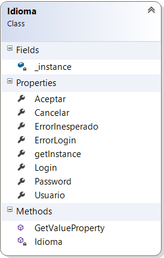
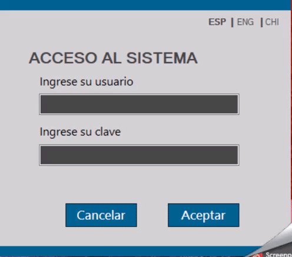
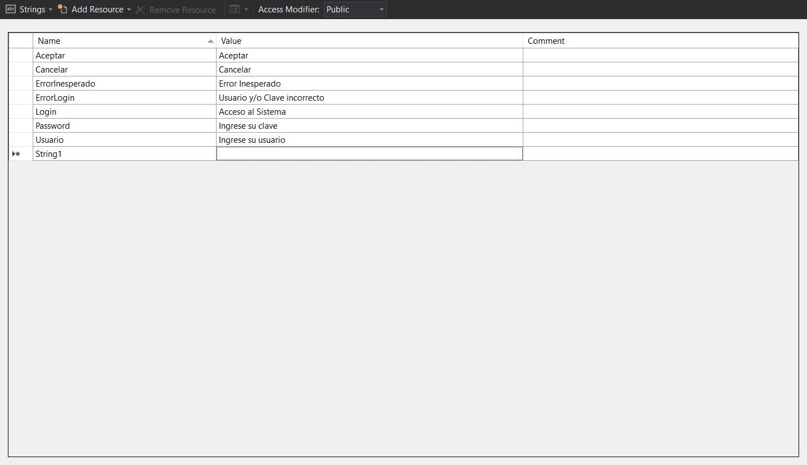
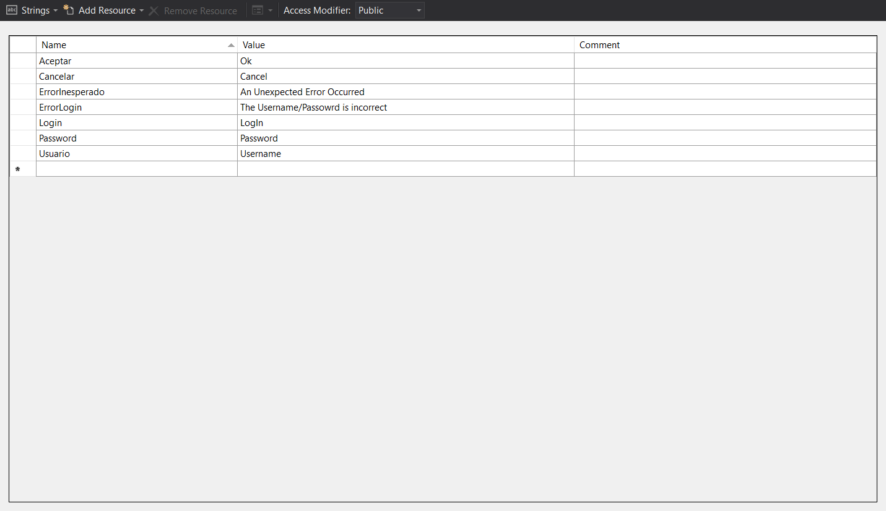
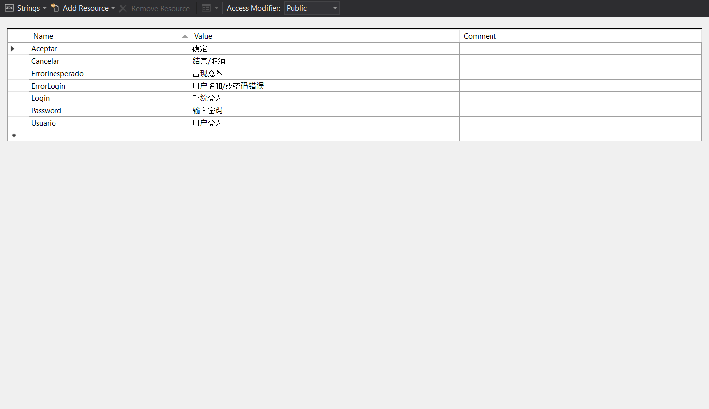

# CultureResources

  Proyecto de clases utilizando `StringResources` y `System.Reflection`, para generar aplicacion multilenguaje.
  
  ### Diagrama de la clase Idioma
  
  
  
  - `Singleton-pattern`
  - __Propiedades.__ Cada una representa la `key` en el archivo `StringRersources`.
  
  - __GetValueProperty()__ Metodo utilizado para acceder al `value` de la propiedad deseada, mediante  `System.Reflection`
    ```c#
    public string GetValueProperty(string name)
        {
            try
            {
                return GetType().GetProperty(name).GetValue(this, null).ToString();
            }
            catch (Exception)
            {
                return null;
            }
        }
    ```


  ### Ejemplo de Uso
  ---
    Uso de la clase `Idioma` en un simple formulario de Login.
    
  
  - __Idiomas.__ Español / Ingles / Chino
  
  - __StringResources.resx__ Archivo que contiene los pares `key/value` base
  
  
  - __StringResources.ES-AR.resx__ Archivo que contiene los pares `key/value` para el idioma Español
  
  
  - __StringResources.EN-US.resx__ Archivo que contiene los pares `key/value` para el idioma Ingles
  
  
  - __StringResources.ZH-CHS.resx__ Archivo que contiene los pares `key/value` para el idioma Chino
  
  
  - __AplicarIdioma()__ Metodo creado para aplicar el idioma seleccionado.
    - Para facilitar las traducciones se opta por nombrar cada elemento del formulario con la siguiente regla:
        `prefijo` tipo control + `nombre` de la propiedad en la clase `Idioma`.
        Tomando como ejemplo el texto "Ingrese su usuario" el control `label` se llamara `lbl`[prefijo] + `Usuario`[propiedad]
  ```c#
  private void AplicarIdioma()
      {
          try
          {
              // Recorro los controles para cambiar el idioma
              // En aquellos elementos que los textos deben ser en mayusculas se establece la propiedad tag = upper
              foreach (Control ctrl in Controls)
              {
                  string value = Idioma.getInstance.GetValueProperty(ctrl.Name.Substring(3));
                  if (string.IsNullOrEmpty(value)) continue;
                  if (ctrl is Label || ctrl is Button)
                      ctrl.Text = ctrl.Tag != null ? ctrl.Tag.ToString() == "upper" ? value.ToUpper() : value : value;
              }
          }
          catch (Exception ex)
          {
              // Formulario creado para mostar el error ocurrido
              using (frmError frm = new frmError(ex.Message, Idioma.getInstance.ErrorInesperado))
                  frm.ShowDialog(this);
          }

          // Cambia a Bold el label correspondiente al idioma actual
          foreach (Label lbl in (from c in panelIdioma.Controls.OfType<Label>()
                                 where !string.IsNullOrEmpty(c.Tag.ToString())
                                 select c))
                  lbl.Font = new Font("Microsoft Sans Serif", 8,
                      (lbl.Tag.ToString() == Thread.CurrentThread.CurrentUICulture.Name.ToUpper()) ? FontStyle.Bold 
                      : FontStyle.Regular);
      }
  ```
